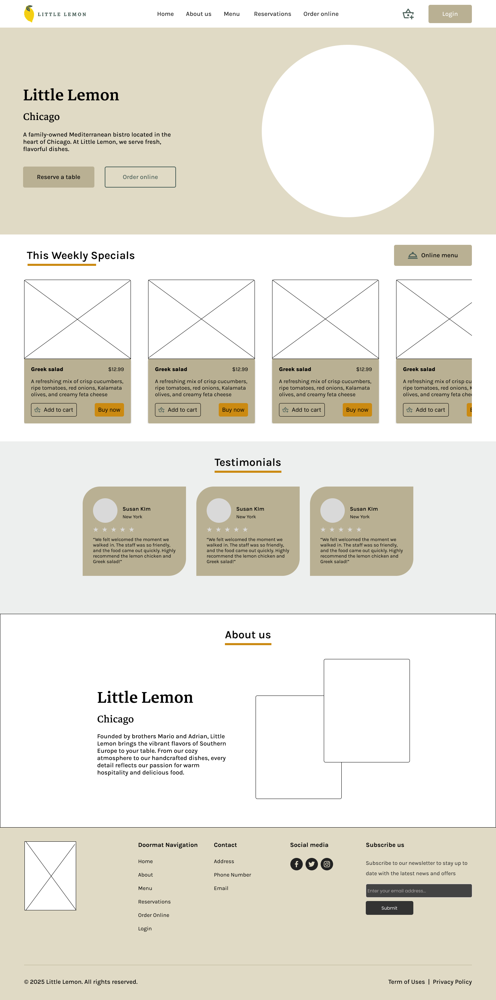
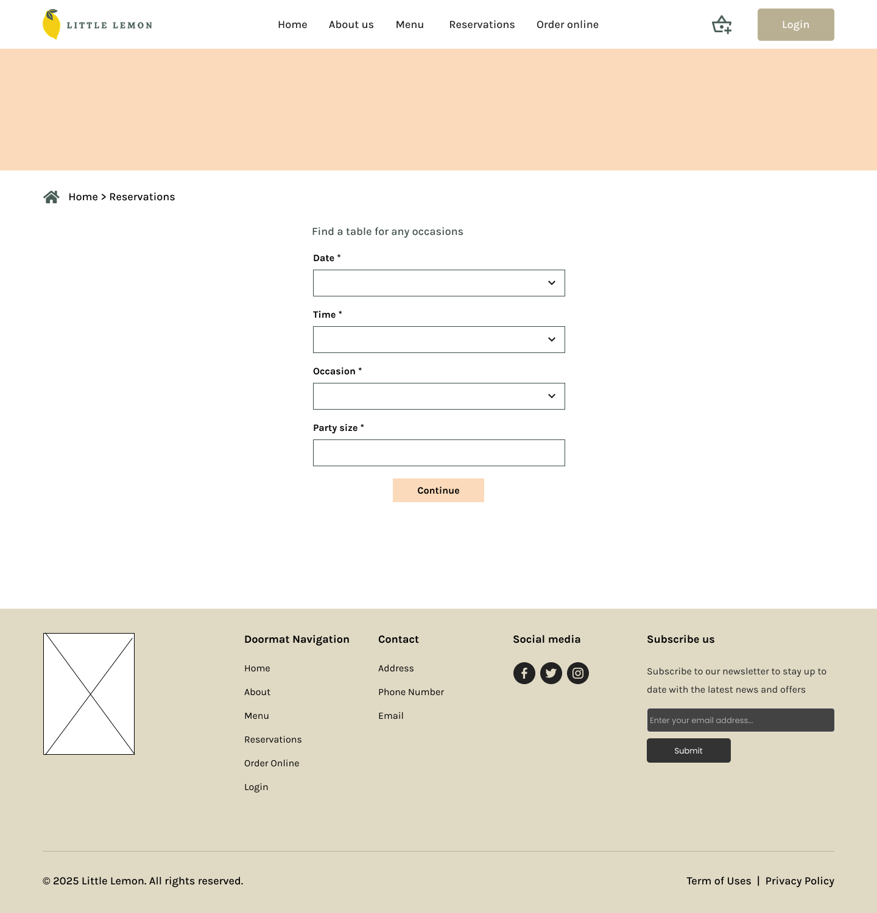
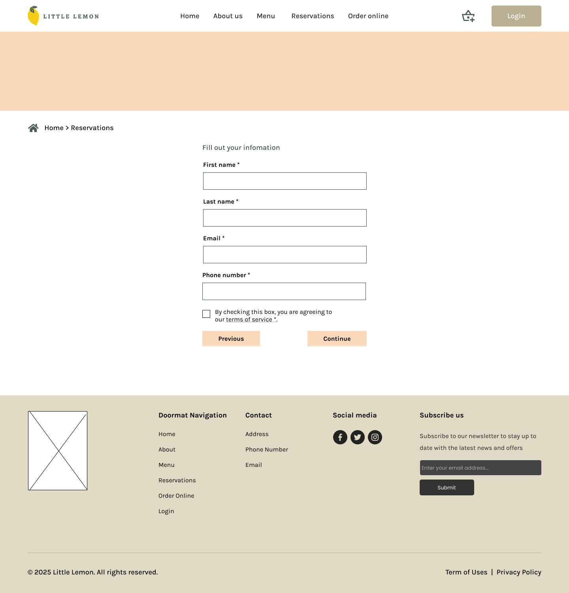
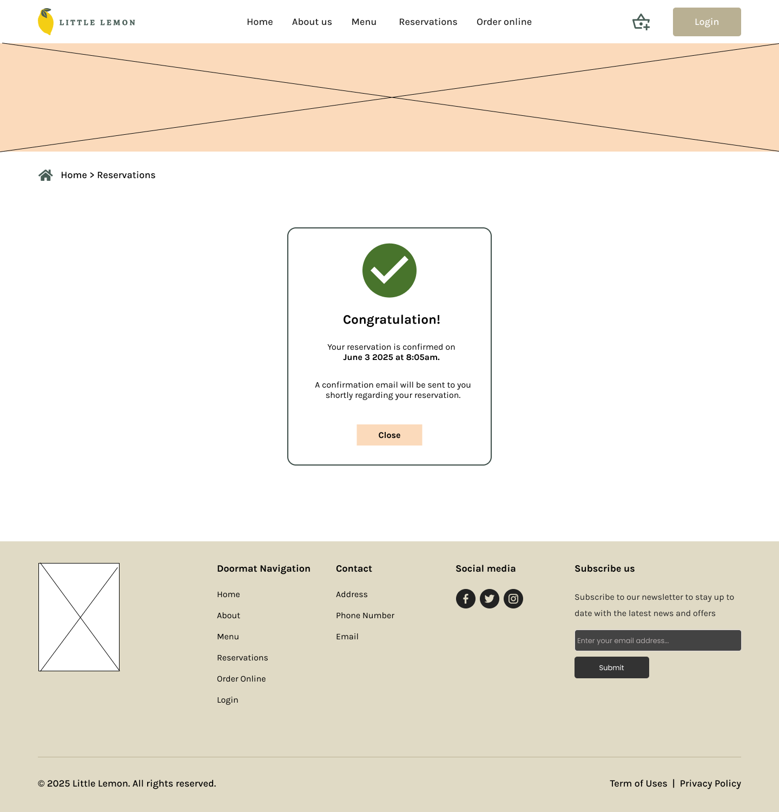
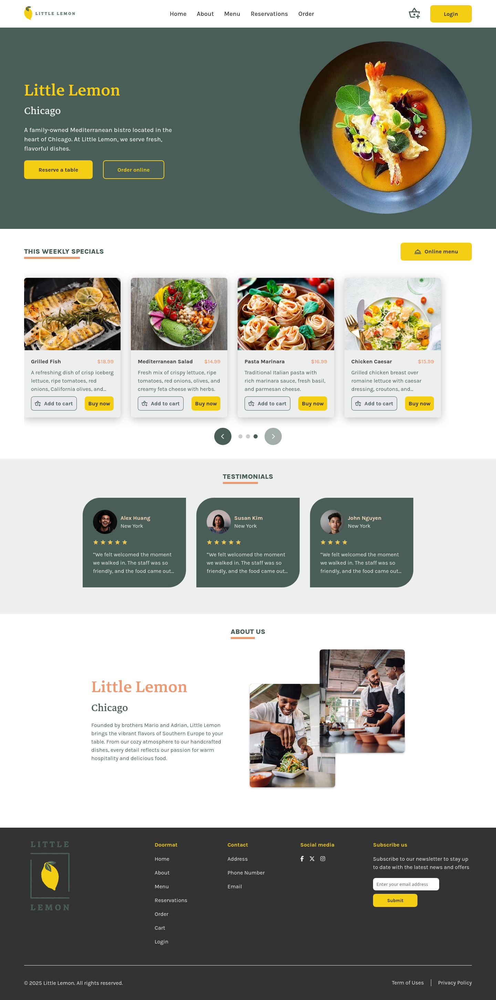
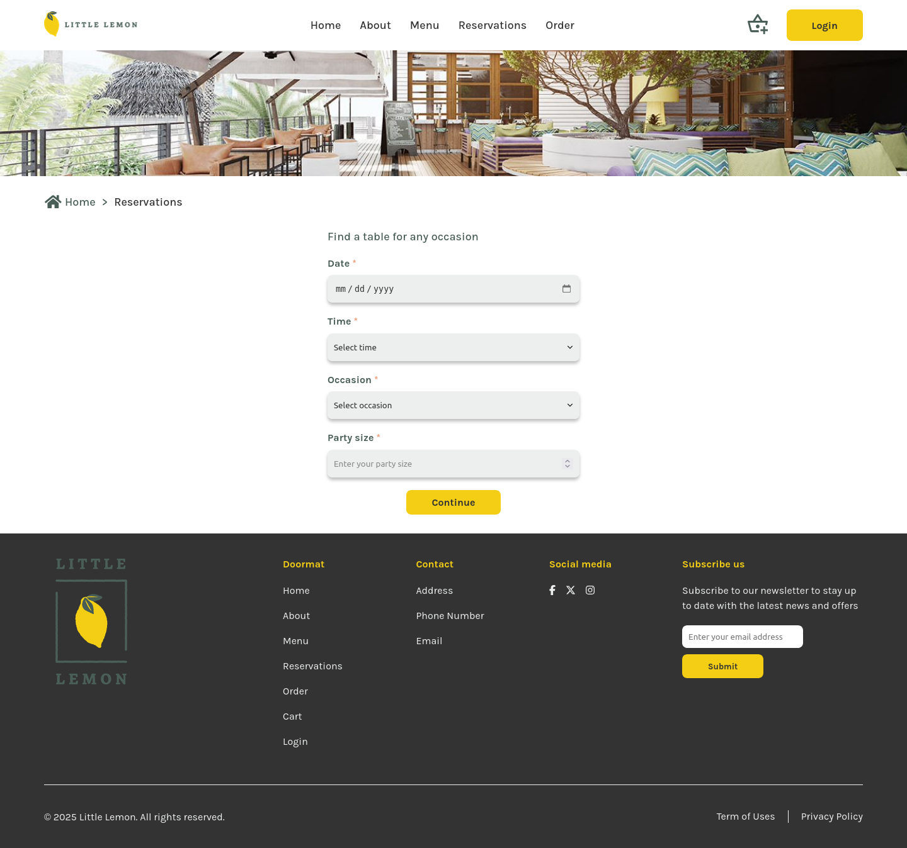
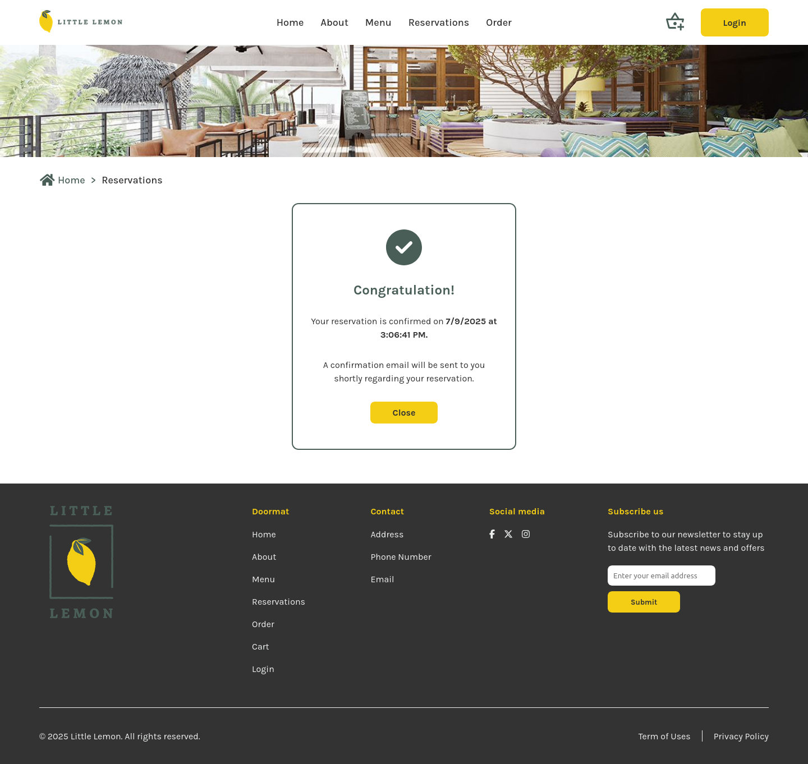

# 🍋 Little Lemon Website

A responsive and accessible restaurant website built as a capstone project for the [Meta Front-End Developer Professional Certificate](https://www.coursera.org/professional-certificates/meta-front-end-developer).  
Live demo: [little-lemon-website-capstone-proje.vercel.app](https://little-lemon-website-capstone-proje.vercel.app/)

## 🧾 Features

- Fully responsive design (desktop, tablet, mobile)
- Specials carousel
- Multi-step reservation form with validation using Formik and Yup
- Accessible components with proper ARIA attributes and keyboard navigation
- Routing with React Router
- Dynamic availability fetched via mock API
- Deployed on Vercel

## 🛠️ Built With

- **React**
- **React Router**
- **Formik + Yup** (form handling & validation)
- **CSS Modules**
- **Jest & React Testing Library** (unit testing)
- **Vercel** (for deployment)

## 🧩 Wireframes

<details>
<summary>Show Wireframe</summary>

| Home Page                            | Reservation Form 1                          | Reservation Form 2                          | Confirmation                                |
| ------------------------------------ | ------------------------------------------- | ------------------------------------------- | ------------------------------------------- |
|  |  |  |  |

</details>

## 📸 Screenshots

| Home Page                            | Reservation Form                          | Confirmation                                |
| ------------------------------------ | ----------------------------------------- | ------------------------------------------- |
|  |  |  |

## 🚀 Getting Started

To run this project locally:

```bash
# Clone the repository
git clone https://github.com/ttnthuy/little-lemon-website.git
cd little-lemon-website

# Install dependencies
npm install

# Start the development server
npm start

# Testing
npm test
```
